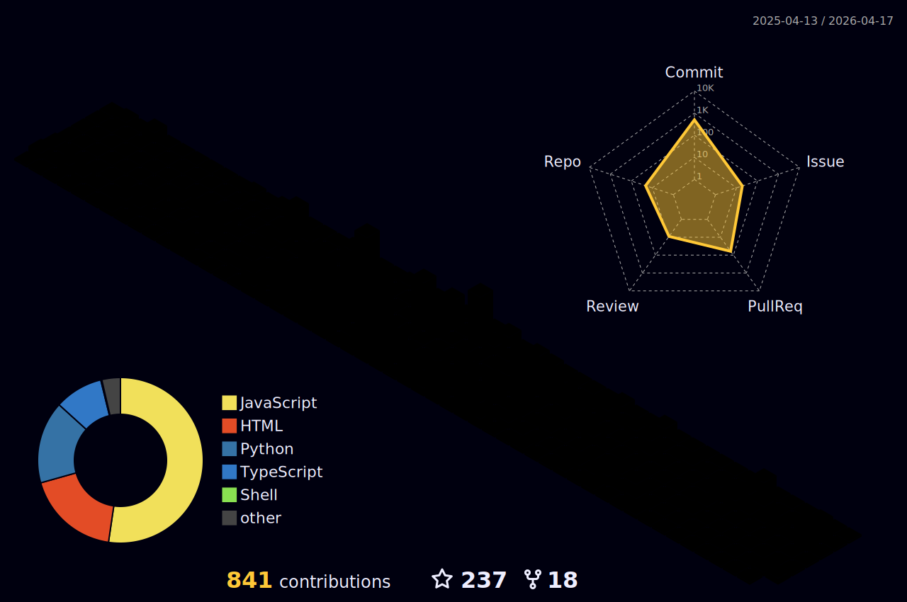

<!--

-->

# Hi, I am failure! 👋
No, I am not a broken man with broken English, that's just the name I go by.

You probably know me as failure. Or maybe as Mash? TheDreamReaper then, maybe? Or X, or A5, if you know me from back in the ancient days? Yes, I have gone by a lot of nicknames—I have been on the internet a long time, m'kay?

But yes, welcome to my profile! Since you are going over my profile, I assume you want a little introduction to who I am, and why you should care.

I am something of an OSS geek; I love contributing to free stuff (read: [Free as in Freedom](https://sagitter.fedorapeople.org/faif-2.0.pdf)). I have contributed to big boy projects like [ListenBrainz](https://github.com/metabrainz/listenbrainz-server), though I tend to contribute more to relatively niche stuff, like [InfiniteChess](https://github.com/Infinite-Chess/infinitechess.org), [WintrChess](https://github.com/WintrCat/wintrchess), and more. I made my own FOSS alternative to Daylio, because it was free as in freemium, not free as in freedom, and that is unacceptable. A company making money via subscriptions? Not on _my_ watch. I also often contribute to Hacktoberfest, both as  contributor and a maintainer.

If you wish to work with me on anything, feel free to contact me—I have tried my hand at pretty much every field, I probably have some experience.

## Looking for my portfolio? 👀
I don't have one! Check out some of the cool stuff I have worked on instead!

### [🌙 Nightlio](https://github.com/shirsakm/nightlio/)
My open-source mood logger and journal. I made it because Daylio sucked!

It's self-hostable, it doesn't sell your data, what more can you ask for? Turns out, a lot actually! Which is why I am still working on it. Think it's missing something? Open an issue. Think it's awesome? Drop a star! ⭐

### [🔍 Heritage Results Archive](https://shirsak.ftp.sh)
Ever been annoyed by people who guard their grades like it's their Horcrux? Yeah, me too, so I scraped everyone's grades and made a website! If you study in [Heritage](https://heritageit.edu/), check it out!

If you study in Heritage, but not in Heritage Institute of Technology? Shoot me a mail and I will scrape your institute's results as well!

### [⚡ PokeBounce](https://github.com/shirsakm/PokeBounce)
Are you into Pokémon? Are you into auto-battlers? Boy, have I got the game for you! Well, I didn't make this, but I contributed a lot to the source code and I want you to check it out!

I also did data analysis and made graphs of the results to check which Pokémon made sense to bet on. Wanna see my graphs? Check out the [original creator's video](https://www.youtube.com/watch?v=C8eWTT5-3i4)!

## Contact

Want to get in contact with me? There are a few ways.

Send me [an email](mailto:shirsakm@gmail.com)! If mailing is too old-fashioned and professional for you, you can find me on Discord, as well.

If you find my Instagram, or Twitter, _don't_ send a message, I am no longer active on those platforms for obvious reasons and have no wish to return any time soon. They are present only for archival purposes.

If all else fails, send me a message on LinkedIn, though I wouldn't wish LinkedIn correspondence on my worst enemy.

If you wish to find or observe me in my natural habitat, you can find me in the Discord / Matrix / IRC channels of any project I contribute to.

<!--
## Look! It's my activity!
Hmm, looks like I have been pretty active recently, let's hope I don't fall into a slump again! 🤞

TO-D0:
- write about myself
- fix the top langs card and stats card being different heights somehow
- write about my past projects
-->
